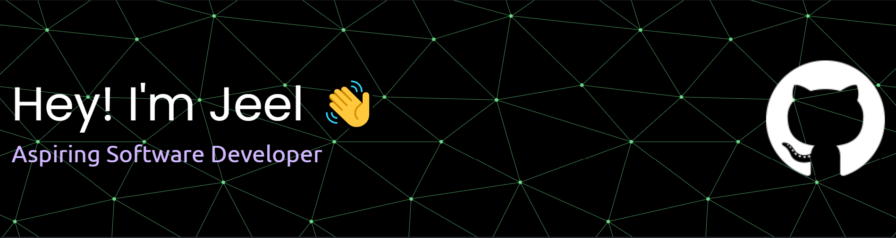

- 👀 Seeking 2024 Summer position
- 🎓 Graduating with BSc in Computer Science from Tornto Metropolitan University 2027
- 📫 Find me on [LinkedIn](https://www.linkedin.com/in/jeelvekaria/)

## Skills

#### Languages

     
    
    
    
    
    
    
    
    

 
 #### Web Development
 

  
  
  
  
  

 
#### Tools

  
  
  
  
  
  
  
<!--    -->

## Stats

